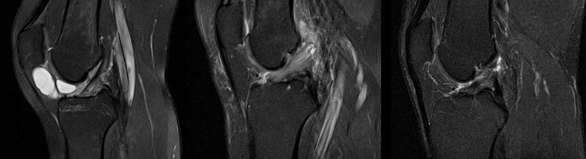

# Knee MRI Classification with CNN, TensorFlow and Python

Classification of Knee MRI images to recognize the Anterior Cruciate Ligament (ACL) condition.
1. healthy, 
2. partially injured, or 
3. completely ruptured

## Dataset
KneeMRI dataset was gathered retrospectively from exam records made on a Siemens Avanto 1.5T MR scanner, and obtained by proton density weighted fat suppression technique at the Clinical Hospital Centre Rijeka, Croatia, from 2006 until 2014. The dataset consists of 917 12-bit grayscale volumes of either left or right knees.

## Model
A MobileNetV2 based image classification model has been trained using [Teachable Machine](https://teachablemachine.withgoogle.com). A subset of the dataset was used to train the model to avoid class imbalance (healthy - 545 images, partially injured - 530 images, completely ruptured - 160 images). 15% of the data are randomly selected for validation. 

The model takes in a full image from an MRI scan of the knee and classifies the ligament conditions into one of the three classes (1) healthy, (2) partially injured, or (3) completely ruptured. Currently the model achieves 70% accuracy on the validation data leaving ample room for improvement.

## Improvements 
Below are some of the work to be done to improve the model performance. 
- Train EfficientNet model with TensorFlow
- Handle class imbalance with augmentation
- Try class weighting approach during training to tackle class imbalance
- Fix gradcam issue (disconnected graph)
- Explore MRNet 
